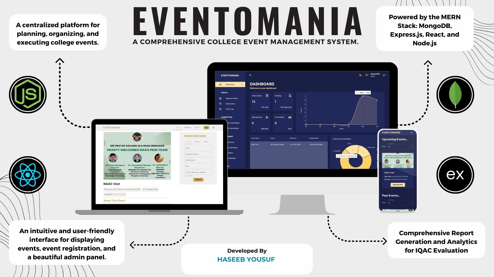

# EVENTOMANIA

Eventomania provides a centralized platform for planning, organizing, and executing college events. Powered by the MERN Stack.
The system provides a highly intuitive and user-friendly interface, coupled with a robust set of tools that greatly enhance the execution of events.
It streamlines the entire event management process, from event registration to post-event analysis.

## Features

- Intuitive and user-friendly UI.
- Efficient Form Handling using Formik and Yup.
- Interactive Dashboard with charts.
- Instant Certificate Distribution via Email with just a click of button.
- Elegant Dark and Light Themes.
- Mobile Responsive.
